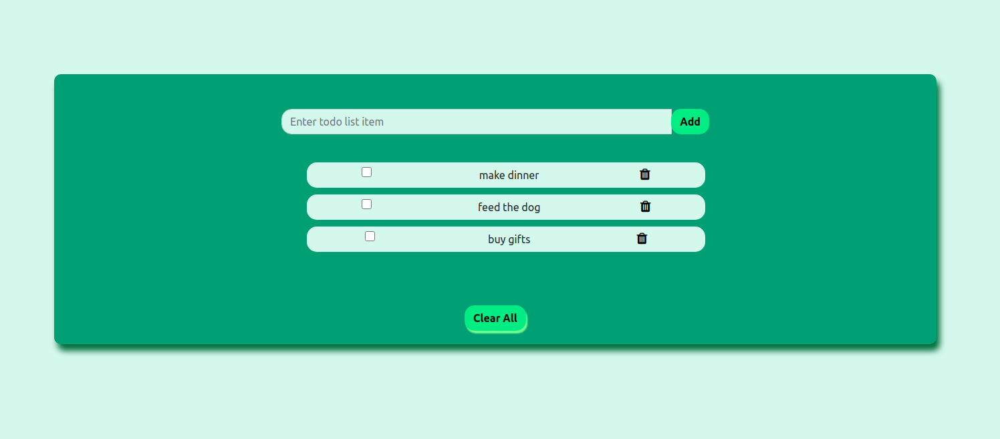

# ToDo-app-node-js-express-js-mongodb

Technology Stack:
Node js
Express js
Mongo DB
Html
CSS

The project uses express routes to post update and delete the data in the mongodb database and subsequently render results on the website for the user.

Features:
Add a new task
Delete a tasks
Update tasks as done
Delete all the tasks

# Dockerized Multi-Service Application Deployment

### Create a docker network

> `docker network create mynetwork`

### Create a docker volume

> `docker volume create myvolume`

### Mongodb container creation

Below command will build the image and create the container for mongodb

> `docker run -d --name mongo-container --network mynetwork -v myvolume --hostname mongo-container -e MONGO_INITDB_ROOT_USERNAME=admin -e MONGO_INITDB_ROOT_PASSWORD=test@123 -p 27017:27017 mongo:latest`

### Access Mongodb

Below command will allow you to access the mongo shell through your container in terminal

> `docker exec -it mongo-container mongosh -u admin -p MONGO_INITDB_ROOT_PASSWORD --authenticationDatabase admin`

After running this command it will ask for password to login into mongosh, as we have provided environment variable `MONGO_INITDB_ROOT_PASSWORD` so it will ask for user password.

---

In **MongoDB Compass** connect to your **Mongodb Server** by creating new connection and providing the credentials.

### Create todo-app, containerize it and connect it to Mongodb container

1. Clone todo-app from github to terminal.
2. For applying CRUD operations create task.js file and inside that CRUD operations will be implemented.
3. From **MongoDB-Compass** the database you created copy the **Copy Connection String** and paste it to the app.js file in **mongoose.connect** function. It will connect your application to Mongodb database.
4. Write **Dockerfile** and build it.
5. Create container for your todo-app and while creating the container write `--network=mynetwork` so that both mongodb container and todo container are both in one network.
6. Browse [https://localhost:3000] and your application is rendered and connected to the mongodb database.

### Create all above services through Docker Compose

Create docker-compose.yml file for creating the services
> `vim docker-compose.yml`

Below command will build the docker-compose.yml file nd start the docker containers
> `docker-compose up --build`
